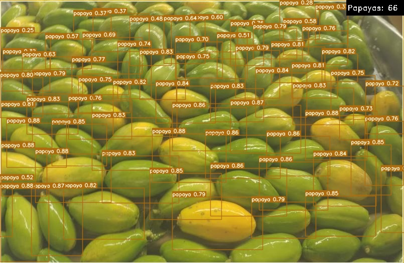

# Installing

1. Create and activate a conda environment running:
``` shell
conda create -n yolov7 python=3.9
conda activate yolov7
```

2. Run the following command from inside the project folder to install the requirements:
``` shell
pip install -r requirements.txt
```

3. Download the initial pretrained network and put inside the project folder: [`yolov7.pt`](https://github.com/WongKinYiu/yolov7/releases/download/v0.1/yolov7.pt)

# Preprocess dataset

In order to train with YOLOv7, it is necessary to generate files `train.txt` and `val.txt` with image paths. To achieve this, adjust the variable `DATASET_PATH` inside the notebook `preprocess.ipynb` and run the notebook.

# Training

Run training using the following command:
``` shell
python train.py --weights yolov7.pt --data "data/papaya.yaml" --workers 4 --batch-size 4 --img-size 640 --cfg cfg/training/yolov7.yaml --name yolov7 --hyp data/hyp.scratch.p5.yaml --epochs 25
```

# Inference 

Note: If you skipped training step and want to use our trained model, download [`best.pt`](https://drive.google.com/file/d/1Mnfp0FQq2YnB9t5O2IQZcsEVwziHCWjq/view?usp=sharing) and use the path to this file as argument for `weights` below.

## Image

Run inference on the test image running the following command:
``` shell
python detect.py --weights runs/train/yolov710/weights/best.pt --source "<your_path>\Teste_Imagem.JPG"
```

<div align="center">
    <a href="./">
        
    </a>
</div>

## Video

Run inference on the test video running the following command:
``` shell
python detect.py --weights runs/train/yolov710/weights/best.pt --source "<your_path>\Teste_Video.mp4"
```

[[Watch the video]](https://drive.google.com/file/d/1MImYuArok7Ju0qz1xMxDQbiCePH2b5Av/view?usp=sharing)